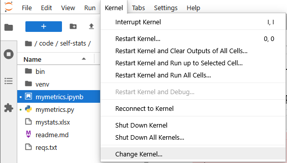
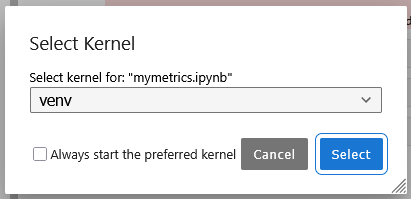

# Using Jupypter Notebook with Pandas to analyze work productivity metrics


---

### Repository Structure
```bash
\self-stats
├── \venv             # ignored via git
├── .gitignore
├── mymetrics.ipynb   # main Jupypter file - usage of pandas
├── mymetrics.py      
├── mystats.xlsx      # raw stats from annotation work - ignored via git    
├── readme.md         # project details
└── reqs.text         # required python libaries    
```

### Stack/Tools
- Python
- Pandas library
- Juypter Notebook

### Setup Notes
#### Virtual Enviornments with Juypter
1) After creating virtual enviorment like usual
```bash
python -m venv venv
venv/Scripts/activate
pip install -r reqs.txt
```
2) the venv needs to then be added to juypter
```bash
ipython kernel install --user --name=venv
```
3) then switch juypter kernel to the venv
###### 
###### 

---
###### [Explore more of my projects on my portfolio site](https://stevendindl.com/)

--- 